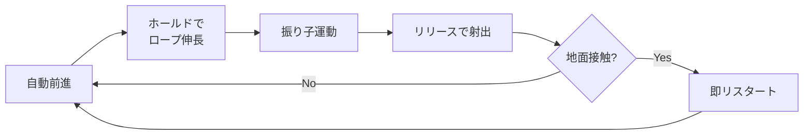

# 企画書A: 振り子グラップル・ランナー

| 項目 | 値 |
| --- | --- |
| `mode_id` | `grapple` |
| `priority` | 1 |
| 実装状況の判定 | `modes/grapple/` が存在しなければ未実装 |

作成日: 2026-09-20

## コンセプト

ロープを伸ばして振り子で飛び、離すタイミングだけで距離を伸ばす1ボタンのエンドレスランナー。

操作は1ボタンのみだが、押している長さがロープの長さ、離した瞬間が射出角度を決めるため、毎回のスイングで判断が発生する。プレイヤーは「どの位相で離すか」を体で覚えることで上達する。

- 想定プレイヤー: 短時間で繰り返し遊ぶハイスコア型ゲームの層
- 1セッション想定: 5〜15分、1ラン30秒〜3分
- 差別化点: 1ボタンでありながら、リリース位相という連続的な最適化問題が常に存在する

## コアメカニクス

3状態それぞれに独立した意味を持たせる。同じ量を重複して制御させない。

| 入力状態 | 制御する量 | プレイヤーの判断 |
| --- | --- | --- |
| タップ(押下) | フック射出 | どの足場を狙うか |
| ホールド(継続) | ロープの長さ | 大きく回すか、小さく速く回すか |
| リリース(解放) | 射出角度と速度 | 距離優先か、高度優先か |

### 物理モデル

キャラクターは質点として扱い、ロープ接続中は固定長の拘束条件を課す。剛体物理エンジンは不要。

```latex
\ddot{\theta} = -\frac{g}{L}\sin\theta
```

リリース時は拘束を解除し、その瞬間の速度ベクトル(円の接線方向)をそのまま初速とする放物運動へ移行する。

### リリース位相と結果

| 離す位相 | 飛び出し方向 | 結果 |
| --- | --- | --- |
| 最下点より前 | 斜め下 | 失速。地面に接触しやすい |
| 最下点 | 水平 | 最高速度。低空を長く飛ぶ |
| 最下点より後 | 斜め上 | 速度は落ちるが高度を稼げる |

最適解が状況依存になる点が設計の核心。次の足場が高ければ遅めに、遠ければ最下点で離す。

## ゲームループと失敗条件

死亡から次のランまで1秒以内を絶対要件とする。



### 失敗条件

- 地面または障害物への接触で即死
- 時間制限やHPは設けない。ミスが一撃で確定する方が緊張感とリトライ速度の両方に効く

### 1ランの長さ

| 習熟度 | 想定ラン時間 |
| --- | --- |
| 初回 | 15〜30秒 |
| 数十回後 | 1〜2分 |
| 熟練 | 3〜5分 |

5分を超えて伸び続ける設計にはしない。距離に応じてスクロール速度を上げ、上限付近で必ず破綻させる。

## 成長要素

ラン内とラン外の両方を持たせる。スコアだけでは継続理由にならない。

### ラン内: アップグレード

一定距離ごとに3択を提示し、リロールを1回だけ許可する。選択肢が刺さらないまま強制されるとビルドが壊れるため、スキップまたはリロールは初期実装に含める。

| 系統 | 例 | 狙い |
| --- | --- | --- |
| ロープ強化 | 最大長+、伸長速度+、空中リフック+1 | 操作可能性を広げる |
| リリース強化 | 解放直後に加速、解放後0.3秒無敵、着地衝撃無効 | リリース判断の価値を上げる |
| リスク | 低空飛行中スコア倍率上昇、ロープ長が短いほど加点 | 安全な最適解を崩す |
| 妨害系 | フック可能点が減る代わりに倍率大 | ビルドの多様性 |

リスク系と妨害系を入れることで最適解が一意に決まらなくなる。これが「スコアが伸びるだけ」という単調さへの対抗策になる。

### ラン外: メタ進行

- 累計距離でステージ解放(公園 → 市街地 → 夜間 → 高所)
- ステージごとに足場の配置密度と重力を変え、同じ操作で異なる最適解を要求する
- 解放は累計値のみで行い、通貨や購入画面は作らない。UIコストに見合わない

## 難易度カーブとテンポ

開始10秒で「面白い状態」になっていること。強化を取るまで退屈という構造は作らない。

| 経過 | 状態 |
| --- | --- |
| 0〜10秒 | 初期ロープ長で通常スイングが成立。チュートリアル文は出さない |
| 10〜40秒 | 足場間隔が広がり、リリース位相の選択が発生 |
| 40秒〜 | スクロール速度上昇、最初のアップグレード |
| 以降 | 30秒ごとに速度+5%、足場密度低下 |

### テンポの数値目標

- 死亡演出: 0.3秒以内
- 入力受付再開: 死亡から0.8秒以内
- アップグレード選択画面: 停止時間3秒以内。長考させない
- 1スイングの周期: 0.8〜1.5秒(短すぎると判断が入らない)

## スコープ

### MVP(判断用プロトタイプ)

目的は「離すのが気持ちいいか」の1点のみを検証すること。面白くなければ題材ごと破棄する。

- [ ] 自動前進する質点
- [ ] ホールドでロープ伸長、天井/アンカーへの固定
- [ ] 振り子運動と拘束解除
- [ ] リリースで接線方向に射出
- [ ] 地面接触で死亡、キー入力で即再開
- [ ] 到達距離の数値表示のみ

スコア、アップグレード、グラフィック、音は含めない。

### v1.0

- アップグレード3択 + リロール1回
- ステージ2種とメタ解放
- ローカルハイスコア、リプレイなし
- BGM 2曲、SE 6種

### 将来拡張(v1.0では作らない)

- オンラインランキング(チート対策コストが高い)
- ゴーストリプレイ
- 追加ステージ

## 技術構成

エンジンは未決定。以下を候補とし、MVP着手時に選定する。

| 候補 | 利点 | 欠点 |
| --- | --- | --- |
| Godot 4 | 2D物理が軽量、エクスポート先が広い、OSS | GDScriptの習熟が必要 |
| Unity 6 | 資料が豊富、アセット流用可 | ビルドが重い、起動が遅い |
| p5.js / TypeScript | 起動が速く検証に最適、ブラウザ即配布 | 製品版の描画品質に限界 |

MVPの検証だけならp5.jsまたはTypeScript + Canvasが最速。製品化を見据えるならGodotを推奨する。

### 実装方針

- 物理は自前実装。角度θと角速度ωのみを状態として持ち、固定タイムステップで積分する
- 剛体物理エンジンは使わない。拘束解除時の速度が不正確になるとゲーム性が壊れるため
- 入力はフレーム単位ではなく実時間で計測し、フレームレート非依存にする
- 作業はmainブランチでは行わず、機能ごとにブランチを切る

## 検証指標と判断基準

MVP完成後、自分と他者2名程度で測定する。

| 指標 | 継続ライン | 測り方 |
| --- | --- | --- |
| 1セッションのラン数 | 10回以上 | ログ出力 |
| 初回プレイの離脱時刻 | 60秒以上 | 観察 |
| 「もう1回」と言うまでの時間 | 死亡後2秒以内 | 観察 |
| リリース位相の分散 | 一定でない | 入力ログ |

最後の指標が重要。全員が最下点でしか離さないなら、判断が存在していないことになり、この案の前提が崩れる。その場合はB案へ移行する。

## リスクと対策

| リスク | 影響 | 対策 |
| --- | --- | --- |
| 振り子の挙動が直感に反する | 操作不能感、即離脱 | 重力とロープ長を実物理より誇張し、周期を体感しやすくする |
| フック対象の視認性が低い | 理不尽な死 | アンカー候補を常時ハイライト、画面外に出る前に予告表示 |
| リリース最適解が一意に決まる | 単調化 | 足場高度をランダム化、リスク系アップグレードで倍率を分岐させる |
| 実装が物理デバッグに沈む | 制作停止 | MVPでは足場を固定間隔にし、乱数生成は後回し |
| スコープが膨張する | 未完成 | MVPの6項目以外はv1.0まで着手しない |

---

# このリポジトリで実装する際の制約

> ここから下は企画書本体ではなく、このリポジトリ（One Button Run）に実装するときの
> 追記である。上の企画書は更地からの開発を前提に書かれているため、既存の L0 契約と
> 衝突する箇所がある。実装する者は必ずこの節に従うこと。

## 1. エンジンは Godot 4 で確定

企画書の「技術構成」は未決定としているが、このリポジトリは既に Godot 4 で動いている。
p5.js / Unity の選択肢は無い。

## 2. 到達距離の表示とスコアはホストが既に持っている

企画書 MVP の「到達距離の数値表示のみ」は**実装不要**。スコア表示・ハイスコア永続化・
UI 更新はすべて `core/game_host.gd` が所有している。モードはスコアに触れない。

ホストのスコアは経過秒数（`score += delta`）なので、スクロール速度が一定なら到達距離と
比例する。スコアの定義そのものを変えるには `core/` の変更が必要で、それは自動フローの
射程外（`ci.yml` の `guard` ジョブが落とす）。**当面やらない。**

## 3. 音と演出は MVP でも必須

企画書 MVP は「グラフィック、音は含めない」としているが、このリポジトリでは
`tests/contract/test_feedback.gd` が spec の以下を検査するため、**演出が無いと CI が落ちる**。

- `required_feedback_events`: `act` / `fail` / `record` の3つ
- `dual_channel_feedback_events`: `act` と `fail` は視覚（パーティクル）と聴覚（SE）の両方

新しいバイナリアセットは追加できない（[ADR 0003](../adr/0003-weekly-large-update-automation.md) 決定4）。
`assets/se/` の既存音源を `volume_db` と `pitch_scale` を変えて流用すること。
v1.0 の「BGM 2曲、SE 6種」も同じ理由で**見送り**。

## 4. 可変 delta での数値積分に注意（最重要）

企画書の実装方針は「固定タイムステップで積分する」としているが、実プレイの時間は
可変 delta で降ってくる。

```gdscript
func _process(delta: float) -> void:
	tick(delta)
```
（`core/game_host.gd`）

一方テストは `FIXED_DELTA := 1.0 / 60.0` の固定刻みで回す（`tests/support/harness.gd`）。

既存モード（runner / flappy）は等加速度運動で delta に対して線形なので問題にならないが、
振り子は `θ̈ = -(g/L)sinθ` で非線形なため、**このリポジトリで初めて「テストと実プレイで
挙動が食い違う」が起こりうるモードになる**。素朴なオイラー法は振幅が発散する。

対策として、**モード内に時間アキュムレータを持ち、`mode_tick` で受けた delta を
1/60 秒の固定刻みに割って回すこと。** L2 のゴールデン回帰（`tests/regression/test_difficulty_curve.gd`）は
ボットの操作回数を ±1 の許容で比較するため、位相がわずかにずれるだけで落ちる。

## 5. アップグレード3択は1ボタンで実装する

企画書 v1.0 のアップグレード3択は、選択用の入力を追加してはならない
（`tests/contract/test_one_button_input.gd` が「ゲームプレイ用アクションはちょうど1つ」を
検査する）。**カーソルが3択を自動で巡回し、タップで確定**する形にすれば成立する。
これは振り子のリリース判断と同じ構造（自動で動くものをタップで止める）なので、
プレイヤーの学習が転用できる。

なお MVP には含めない。

## 6. メタ進行（ステージ解放）は見送り

企画書「ラン外: メタ進行」の累計距離によるステージ解放は、永続化が必要になる。
永続化は `core/game_host.gd` の `HIGH_SCORE_PATH` が所有しており、自動フローからは
変更できない。**当面やらない。**

## 7. 参照ボットが企画の成否判定を兼ねる

`spec.json` に参照ボットを同梱し、`bot_min_survival_seconds`（既存モードでは 180 秒）を
8シードすべてで生存させる必要がある（[ADR 0003](../adr/0003-weekly-large-update-automation.md) 決定2）。

ここで企画書の検証指標と接続する。企画書は「全員が最下点でしか離さないなら、判断が
存在していないことになり、この案の前提が崩れる」を最重要指標としている。これは
**「常に最下点で離すボット」を書いて 180 秒生存できるかどうかで機械的に測れる**。

- 最下点固定ボットが生存できてしまう → 判断が存在しない。足場の高度差を広げるなどして
  判断を作る必要がある
- 最下点固定では死に、足場高度に応じて位相を変えると生存できる → 判断が存在する

ボットが生存できないときに**閾値を下げてはならない**。モードを簡単にすること。

## 8. MVP の完成形

上を踏まえた MVP（= 週次アップデート1回分）は次のとおり。

- [ ] 自動前進する質点（スクロールで表現。`modes/flappy/flappy_mode.gd` が参考になる）
- [ ] ホールドでロープ伸長、アンカーへの固定
- [ ] 振り子運動と拘束解除（固定刻みアキュムレータ経由で積分）
- [ ] リリースで接線方向に射出
- [ ] 地面接触で死亡（`is_failed()` が true を返す。ホストが GAME_OVER に遷移させる）
- [ ] 足場は固定間隔（企画書リスク表「MVPでは足場を固定間隔にし、乱数生成は後回し」）
- [ ] `act` / `fail` / `record` の演出（既存 SE の流用 + `Polygon2D` / パーティクル）
- [ ] 参照ボット（`decide(main, harness)`）
- [ ] `get_difficulty()` はスクロール速度を返す（単調非減少かつ `max_speed_cap` 以下）
