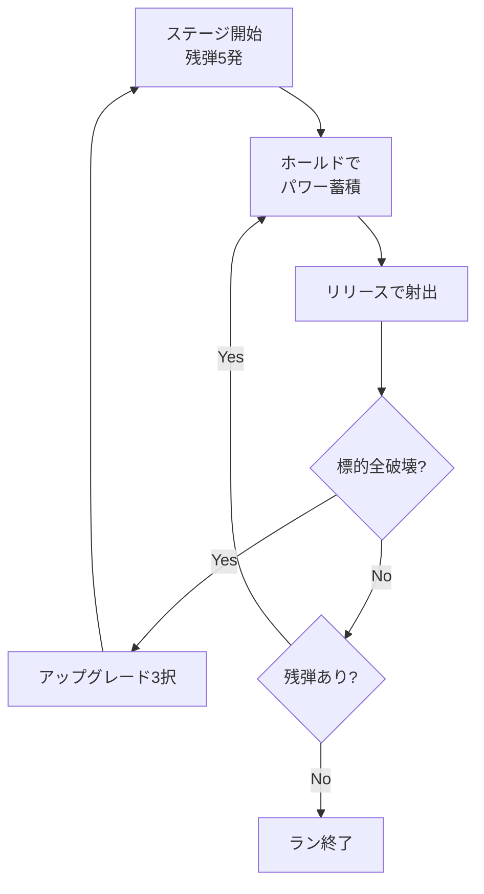

# 企画書B: チャージ投擲ローグライク

| 項目 | 値 |
| --- | --- |
| `mode_id` | `charge` |
| `priority` | 2 |
| 実装状況の判定 | `modes/charge/` が存在しなければ未実装 |

作成日: 2026-09-20

## コンセプト

1ボタンで角度と強さの2軸を指定し、標的を撃ち抜いていくステージ制ローグライク。

押している間にパワーが溜まり、離した瞬間の角度メーターの位置で射出方向が決まる。ゴルフゲームのパワーバーを縦横2軸に拡張した構造。

- 想定プレイヤー: パズル的な最適解探索を好む層
- 1セッション想定: 10〜20分、1ラン3〜8分
- A案との役割分担: A案が操作の気持ちよさを問うのに対し、B案は実装コストの低さと構造の確実性を問う。先にBを作って感触を測り、Aの投資判断材料にする

## コアメカニクス

1ボタンで2つの連続値を指定する。角度は時間経過で自動変化し、パワーは入力時間で決まる。

| 入力状態 | 制御する量 | プレイヤーの判断 |
| --- | --- | --- |
| タップ(押下) | 角度メーター始動 | いつ構えるか |
| ホールド(継続) | 射出パワー(0〜100%) | 溜めるほど速いが角度が進む |
| リリース(解放) | 角度の確定と射出 | どの角度で妥協するか |

### 角度とパワーの結合

角度メーターは押下と同時に一定速度で往復を始める。パワーも同時に溜まり続ける。つまり **パワーと角度を独立に選べない**。

```latex
\theta(t) = \theta_{min} + (\theta_{max}-\theta_{min}) \cdot \left|\sin(\omega t)\right|, \quad P(t) = \min(t / t_{max}, 1)
```

この結合が設計の核心。欲しい角度で離すとパワーが足りず、フルパワーまで溜めると角度が通り過ぎる。角度メーターの周期とパワー蓄積速度の比を調整することで、難易度を連続的に制御できる。

### 射出後

放物運動で飛び、標的に接触すると破壊。壁や地形での反射を1回まで許可すると、直接狙えない標的を跳ね返しで狙う選択肢が生まれる。

## ゲームループと失敗条件

A案と異なりステージ制。1ステージ = 標的全破壊で、残弾がリソースになる。



### 失敗条件

- 残弾が尽きた時点でラン終了。即死ではない
- 標的破壊で残弾+1のボーナスを設けることで、上手いプレイほど長く続く

### 1ランの長さ

| 習熟度 | 想定到達ステージ | ラン時間 |
| --- | --- | --- |
| 初回 | 2〜3 | 2分 |
| 数十回後 | 8〜12 | 5分 |
| 熟練 | 20以上 | 10分 |

ステージ間の待ち時間はゼロにする。破壊演出0.5秒 → 即アップグレード選択 → 即次ステージ。

## 成長要素

ステージクリアごとに3択 + リロール1回。A案より選択回数が多いため、選択肢の総数を多めに用意する。

### ラン内: アップグレード

| 系統 | 例 | 狙い |
| --- | --- | --- |
| メーター操作 | 角度メーター速度-15%、最大パワー+20% | 難易度を直接緩和 |
| 弾性質 | 貫通、爆発、反射回数+1、重力半減 | 狙い方そのものを変える |
| リソース | 残弾+1、破壊時の残弾回復確率 | ラン継続時間を伸ばす |
| リスク | 残弾-2の代わりに全弾貫通、一撃必中ボーナス | ビルドの分岐 |

弾性質系が最重要。重力半減を取ると角度の意味が変わり、貫通を取ると標的の配置の読み方が変わる。**操作は同じまま、最適な角度とパワーの組み合わせが変わる**ことが繰り返し遊ぶ動機になる。

### ラン外: メタ進行

- 到達ステージ数で初期装備(スターター弾)を3種類まで解放
- スターターごとに開始時のメーター速度と残弾が異なり、別ゲーム感が出る
- 実績的な解放は作らない。選べる初期条件だけで十分

## 難易度カーブとテンポ

難易度の主軸は角度メーターの速度と標的配置の2つ。ステージ番号に応じて連続的に上げる。

| ステージ | 角度メーター周期 | 標的 |
| --- | --- | --- |
| 1〜3 | 2.0秒 | 1〜2個、直線上 |
| 4〜8 | 1.6秒 | 3個、高低差あり |
| 9〜15 | 1.2秒 | 遮蔽物あり、反射必須 |
| 16〜 | 0.9秒 | 移動標的 |

### テンポの数値目標

- 標的破壊から次弾の入力受付まで: 0.5秒以内
- ステージクリア演出: 0.8秒以内
- アップグレード選択: 停止時間3秒以内
- ラン終了から再開まで: 1.5秒以内

A案より1回の判断が重いため、リトライ速度の要求はやや緩い。ただしステージ間の間延びは致命的。

## スコープ

### MVP(判断用プロトタイプ)

検証したいのは「角度とパワーが結合していることが、窮屈ではなく面白いか」の1点。

- [ ] 固定位置の発射台
- [ ] 押下で角度メーター往復開始、同時にパワー蓄積
- [ ] リリースで放物運動の射出
- [ ] 標的1〜3個、接触で破壊
- [ ] 残弾5発、尽きたら即リスタート
- [ ] クリア時に次ステージへ(配置は固定でよい)

アップグレード、乱数生成、グラフィック、音は含めない。

### v1.0

- アップグレード16種、3択 + リロール1回
- ステージ自動生成、20ステージ以上
- スターター3種のメタ解放
- ローカルハイスコア

### 将来拡張(v1.0では作らない)

- 日替わりチャレンジ(固定シード)
- ステージエディタ
- オンラインランキング

## 技術構成

A案と同じ候補群。B案は物理が放物運動と円の衝突判定のみなので、どの環境でも成立する。

| 候補 | 利点 | 欠点 |
| --- | --- | --- |
| p5.js / TypeScript | 最速で検証可能、ブラウザ配布 | 製品版の見栄えに限界 |
| Godot 4 | 2Dに強い、エクスポート先が広い | 本案には機能過剰気味 |
| Unity 6 | アセット流用可 | ビルドが重い |

B案はMVPを1日で作れる規模なので、**p5.jsまたはTypeScript + Canvasで着手し、続行判断が出てからGodotへ移植**する方針を推奨する。

### 実装方針

- 物理は放物運動のみ。等加速度運動の解析解で位置を求め、積分すら不要
- 衝突判定は円 × 円と円 × 線分のみ
- 反射は線分の法線ベクトルで速度を鏡像変換する
- 角度メーターとパワーはどちらも実時間基準にし、フレームレート非依存にする
- 作業はmainブランチでは行わず、機能ごとにブランチを切る

## 検証指標と判断基準

| 指標 | 継続ライン | 測り方 |
| --- | --- | --- |
| 1セッションのラン数 | 5回以上 | ログ出力 |
| 初回プレイの離脱時刻 | 90秒以上 | 観察 |
| 外した時の反応 | 「惜しい」であり「理不尽」ではない | 観察・聞き取り |
| パワーの使用分布 | フルパワー一辺倒でない | 入力ログ |

3つめが最重要。外した原因が自分の判断ミスだと納得できるかどうかで、この案の成否が決まる。角度メーターが速すぎて運ゲーに感じられるなら、周期を落とすだけで直るのか、構造的に無理なのかを切り分ける。

4つめが偏る場合、パワーと角度の結合が機能していない。メーター周期とパワー蓄積速度の比を再設計する。

## リスクと対策

| リスク | 影響 | 対策 |
| --- | --- | --- |
| メーターを見る作業に収束する | 操作の快感が生まれない | 弾道プレビューを出さず、体感で覚えさせる。破壊演出を過剰なほど派手にする |
| 運ゲーに感じられる | 即離脱 | メーター周期を初期は2秒まで落とす。失敗しても残弾で再挑戦できる構造で緩和 |
| A案に比べて操作が地味 | 継続率が伸びない | 弾性質アップグレードで画面上の変化量を稼ぐ |
| 選択肢が足りずビルドが単調 | 中盤で飽きる | v1.0で16種を確保。MVPでは判断対象外 |
| 両案を並行して作り両方未完成 | 最悪ケース | Bを先に完成させ、続行判断が出るまでAには着手しない |

### 推奨する進め方

B案のMVPを先に作る。実装が軽く、1ボタン3状態の設計が成立するかを安く確かめられる。ここで手応えがあればA案のMVPへ進み、両者を比較して本命を1本に絞る。

---

# このリポジトリで実装する際の制約

> ここから下は企画書本体ではなく、このリポジトリ（One Button Run）に実装するときの
> 追記である。上の企画書は更地からの開発を前提に書かれているため、既存の L0 契約と
> 衝突する箇所がある。実装する者は必ずこの節に従うこと。

## 0. 実装順序は A 案が先（企画書の推奨とは逆）

企画書は「Bを先に完成させ、続行判断が出るまでAには着手しない」を推奨しているが、
**このリポジトリでは順序を逆にした。** 理由は [ADR 0006](../adr/0006-proposals-as-weekly-input.md) を参照。

要点だけ言うと、企画書の推奨は「B案のほうが実装が軽い」という前提に立っているが、
この前提はこのリポジトリでは成立しない。`modes/runner/` と `modes/flappy/` に
エンドレスランナーの部品（スクロール、重力積分、速度カーブと上限、スポーンと消去、
衝突判定）が既にあるため、既存資産からの差分で測ると A 案のほうが軽い。
B 案は固定発射台でスクロールが無く、流用できるものがほとんど無い。

**この企画書は `priority: 2` であり、`modes/grapple/` が存在するまで着手しない。**

## 1. エンジンは Godot 4 で確定

企画書の「p5.js で着手し、続行判断が出てから Godot へ移植」は**採用しない**。
このリポジトリは Godot 4 で動いており、移植のコストを払う理由が無い。

## 2. 「即死ではない」は L0 契約と衝突する（最重要）

企画書は「残弾が尽きた時点でラン終了。即死ではない」としているが、
`tests/contract/test_playability.gd` の `_test_idle_death` が
**「無操作なら `idle_death_max_seconds` 以内に必ず失敗する」**を検査する
（既存モードでは 10 秒）。何もしなければ何も起きないゲームは CI を通らない。

回避策: **構えに制限時間を設ける。** 押さずに一定秒が過ぎたら残弾を1つ失う（見送り）。
同時に `grace_seconds_min`（既存モードでは 1.0 秒）も満たす必要があるため、
初回の見送りまでは 1.0 秒以上空ける。

例: 残弾5発 × 見送り 1.8 秒 = 9.0 秒 → 1.0 秒以上かつ 10 秒以内を両方満たす。

この追加は企画書のテンポ目標（ステージ間の間延びは致命的）とも方向が一致しており、
企画の意図を損なわないと判断している。

## 3. スコアはステージ数にできない

企画書はステージ制で、到達ステージ数がスコアに相当する。しかしスコアは
`core/game_host.gd` が経過秒数として所有している（`score += delta`）。
定義を変えるには `core/` の変更が必要で、自動フローの射程外
（`ci.yml` の `guard` ジョブが落とす）。

**ハイスコアは生存時間のままにし、ステージ数はモード内の表示に留めること。**

## 4. 難易度はアップグレードを反映してはならない

`tests/contract/test_playability.gd` の `_test_difficulty_shape` が
「難易度は単調非減少」「上限がある」を検査する。

企画書のアップグレード「角度メーター速度-15%」は難易度そのものを下げるため、
`get_difficulty()` がアップグレード後の実効値を返すと契約違反になる。

**`get_difficulty()` はステージ由来の素の難易度だけを返すこと。**
（例: 角度メーター周期の逆数をステージ番号から算出した値。アップグレードは加味しない）

## 5. 音と演出は MVP でも必須

企画書 MVP は「グラフィック、音は含めない」としているが、
`tests/contract/test_feedback.gd` が spec の以下を検査するため、演出が無いと CI が落ちる。

- `required_feedback_events`: `act` / `fail` / `record` の3つ
- `dual_channel_feedback_events`: `act` と `fail` は視覚と聴覚の両方

新しいバイナリアセットは追加できない（[ADR 0003](../adr/0003-weekly-large-update-automation.md) 決定4）。
`assets/se/` の既存音源を `volume_db` と `pitch_scale` を変えて流用すること。

## 6. アップグレード3択は1ボタンで実装する

選択用の入力を追加してはならない（`tests/contract/test_one_button_input.gd` が
「ゲームプレイ用アクションはちょうど1つ」を検査する）。**カーソルが3択を自動で巡回し、
タップで確定**する形にすれば成立する。これは角度メーターと同じ構造
（自動で動くものをタップで止める）なので、プレイヤーの学習が転用できる。

なお MVP には含めない。

## 7. メタ進行（スターター解放）は見送り

永続化は `core/game_host.gd` の `HIGH_SCORE_PATH` が所有しており、自動フローからは
変更できない。**当面やらない。**

## 8. 参照ボットが企画の成否判定を兼ねる

`spec.json` に参照ボットを同梱し、`bot_min_survival_seconds` を8シードすべてで
生存させる必要がある（[ADR 0003](../adr/0003-weekly-large-update-automation.md) 決定2）。

本案では、**角度とパワーが結合しているために解が存在しない標的配置**があると
ボットが生存できない。これは企画書のリスク「運ゲーに感じられる」がそのまま
現れたものなので、**ボットが落ちることは有益な検出である**。

ボットが生存できないときに**閾値を下げてはならない**。標的配置を緩めるか、
メーター周期とパワー蓄積速度の比を見直すこと。
